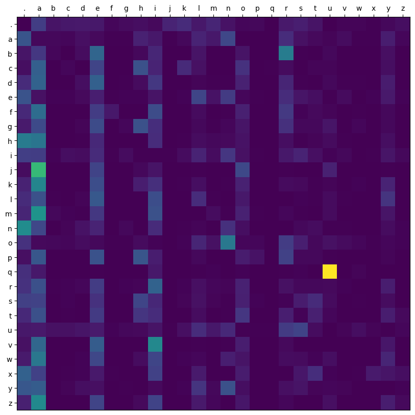

<a name="readme-top"></a>


<!-- PROJECT LOGO -->
<div align="center">


  <h2 align="center">
    Bigram Language Model
  </h2>
</div>


<div>
<div align="center">
    
</div>

<br/>
<br/>

Basic probablistic language model<br/>
Next char probabilities are calculated from a dataset.
<br/>
Model can generate approximately similar terms.
</div>


<!-- GETTING STARTED -->

## Usage

Clone the repo
   ```sh
   git clone https://github.com/ryansereno/bigram
   ```
Run
   ```sh
   python model.py
   ```

<p align="right">(<a href="#readme-top">back to top</a>)</p>


